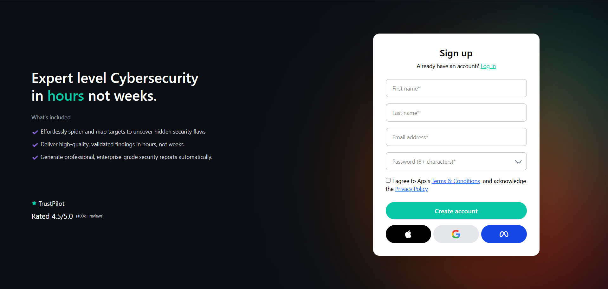
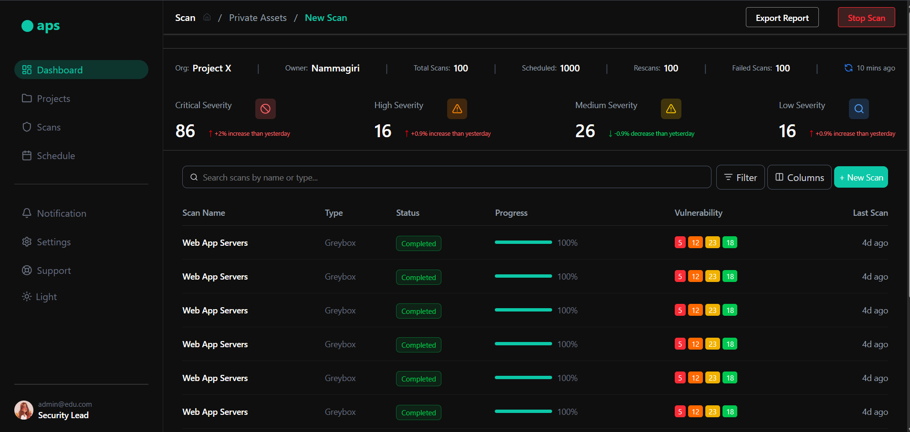
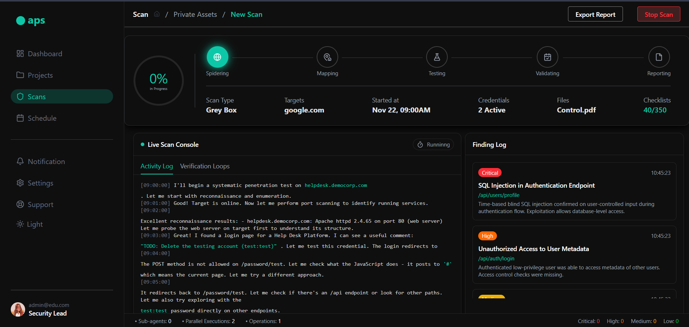

# APS Security Dashboard

A frontend implementation of the dashboard where you can see your data being visualized and mapped in a modern dashboard style type. You also get a smoooth toggle for the dark and light mode

## Tech Stack Used
- React (Vite): As a frontend framework
- Tailwind CSS: For the styling purpose
- React Router DOM: For the smooth navigation between the pages and components
- React Hot Toast: It adds interactivity to the buttons
- Lucide React: Used this for using react lucide icons

## Setup Instructions
1. Clone the repo
   git clone https://github.com/abhishekpandey-001/aps-dashboard

2. Install dependencies
   npm install

3. Run the dev server
   npm run dev

4. Open the localhost in your system in your browser

## Features
- Login page with navigation to Dashboard content with data
- Dashboard with navbar, table, and cards for sevirity display
- Active Scan Detail with live console and finding log
- Smooth light and dark mode toggle
- Toast notifications on button clicks to add little interaction
- Created mock data for all the screens
- Also, search functioanlity in the search box, you can search for selected scan names there
- Scan section with progress bar, live scan console, and finidng logs section
- Also a small footer to make the UI look better

## Images for the UI
### Login/SignUp Page

### Dashboard

### Scans

## Known Limitations
- Mobile responsiveness is partially implemented
- No real backend or authentication